# Project 3 Documentation

## **Introduction/Motivation**

For our visualization we are analyzing the scripts of the Disney show Phineas and Ferb. Our visualization can be used to analyze who has lines in the show as well as what they say and when they speak. We can see who says certain words most often as well as when in episodes they say it. We can also see what words are most often said with the selected words. Finally we can see who shares scenes together which can have an influence on what is said during those scenes. The combination of charts we have created allows the user to see the plot structure within an episode of the show, when specific characters are more involved through the seasons and what conversation topics are most common throughout the show.

## **Data**

_Data Processing:_

The data we received is organized into a folder for each season, and a file for each episode. Each episode had a new line every time a new character started speaking, or an interruption / scene change occurred. To pre-process this data, we create a script which takes each line and organizes it into one big CSV, with columns for speaker, line, season, episode, scene_count, and line_count. To do this, we navigated through each line, for every episode, and for every season. For every speaking line, we recorded the speaker, the contents of the line, the line count, the season (denoted by the current folder) the episode (denoted by the current file), and the scene count, which starts at 1 and iterates when a line doesn’t appear to be a speaking line. For every instance of text surrounded by braces or parentheses, we removed those sections (as they were never spoken lines). Additionally, when a character spoke in an episode, we added that episode to a dictionary, which recorded which episodes each character spoke in. An example of how an entry in that dict looks like is as follows: characterEpisodesData[‘perry’] = [1,2,3,4,5,6]

For lines that don’t appear to be speaking lines (lines that begin with a parenthesis instead of a speaker’s name), we first checked whether those lines contained “perry” and “chatter”. If it did, we marked that as a speaking line for perry the platypus, since he would otherwise have no speaking lines. Otherwise, we considered that line to be a scene break and iterated our scene count. While this would occasionally iterate scenes when there is no scene change, it allowed us to always successfully change scenes when there _is _a scene break. I.e. we had no false negatives for scene changes. This would allow us to have a more accurate chord diagram, which is the only chart which would use the _scene_count_ data column.

After iterating through all the data and recording it to a variable, we checked which characters spoke in fewer than 5 episodes, and removed all those characters’ lines from the dataset. Then, we recorded the entire remaining dataset to a CSV in bulk, in order of when the line was spoken.

Data Source: 

[https://github.com/captainsidd/phineas-ferb/tree/master/transcripts](https://github.com/captainsidd/phineas-ferb/tree/master/transcripts)

Likely Root Data Source: [https://phineasandferb.fandom.com/wiki/Category:Transcripts](https://phineasandferb.fandom.com/wiki/Category:Transcripts)

## **Visualization Components**

### **Line Counts Per Speaker _Bar Chart_**

The character bar chart is the chart in the top-right corner of the visualization. It shows the total number of lines spoken by significant characters as a bar. Characters with the most lines are on the left side of the chart, and characters with the least lines are on the right. The chart will show a max of 13 bars at once, with bar 13 being a bar labeled “other.” When a bar is clicked, it will filter all dynamic charts to include only lines represented by that bar. 

### **Lines Per Episode _Timeline_**

The episode timeline is the chart in the top-right corner of our visualization. It shows the total number of lines spoken by significant characters in each episode as a bar, organized chronologically, with each bar color-coded according to season. When filtered, the timeline will change to reflect new data, with bars staying in their horizontal position to more easily track which episodes / sections of seasons are included in that filter. Clicking a bar will filter all dynamic charts to include only data which was represented by that bar. 

### **Word Occurrence _Wordcloud_**

The word cloud displays the words most used in the range of selected episodes or by the selected characters. It uses both color and size of the words to relay how frequently the words are said. There is a legend for the word cloud immediately to the left containing the ranges of occurrences for each color. For example, if a word is only said once, it would be shown in the teal green color, and the font size would be smallest in comparison to words of any other color. The word cloud will update when the season or episode dropdowns are updated, when an episode is selected from the episode timeline bar chart, or when a character is selected from the character bar chart. A word in the word cloud can be clicked to filter the data to lines that contain the selected word. This will not override previous filtering of episodes or characters, and it will update the bar charts and the line chart.

### **Interaction Chord _Diagram_**

The chord diagram is used to show who is in a scene together and how many times they share scenes. It does so by first determining which characters are important, which is at least partially done in data preprocessing which takes out most of the random characters that are used as extras, though some remain. We then, using the scene count that is done in data preprocessing by making a new scene every time there is a parenthesis. We also set Ferb to always be in a scene with Phineas, since Ferb is a largely non-speaking character, we also did this with Perry the Platypus by having Perry in every scene with Major Monogram, Carl, and Doofenshmirtz. This count is stored in a square matrix. Then I went through this square matrix and set to zero the diagonal of the matrix, since of course a character is in the scene with themself, and I also zeroed all the values that were below a certain threshold since if that were not done it would be impossible to interpret the chords. We tried to dynamically update it when scenes change but we are unable to get it to update the diagram itself, though we were able to get the new set of important characters.

### **When Main Characters Speak in Episodes _Line Chart_**

The “Who Speaks When” line chart is used to show when the main characters generally speak in the episodes. Eleven characters that are part of the show across all seasons were selected to be included in this plot. The x-axis shows time into the episode. This value is shown as a percent since the number of total lines varies between each episode. 0% corresponds to the very first line of an episode, and 100% represents the very last line of an episode. The y-axis shows counts of the number of lines spoken by a character at that point in the episode. These counts update with selections made in other charts to filter by character and by season or episode. The legend on the right of the line chart shows the 11 characters and the color corresponding to them. The circles can be clicked to toggle between hiding or showing their lines on the plot. When shown, the circle will be fully opaque, but when hidden, the circle will appear very faint. 

## **Design**

### **_Layout_**

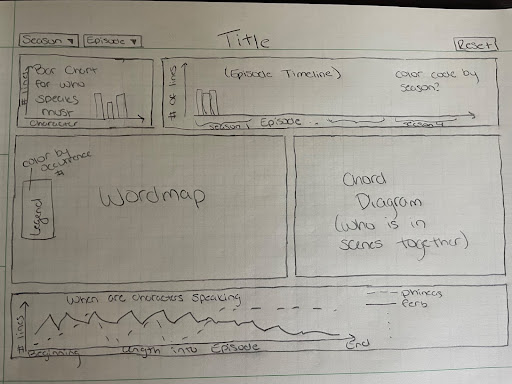

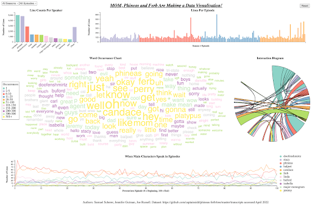

We placed the Character Bar Chart and Episode Timeline at the top of the visualization because, since they’re both bar charts, they’d be able to be placed next to each other and be visually appealing if we gave them the same height. 

We placed the Wordcloud and the Chord diagram in the center of the page since they’re tall, and would be able to fit next to each other as well. 

We placed the Line chart across the bottom of the page since a longer line chart would allow us to more easily look at trends in the chart.

### **Line Counts Per Speaker _Bar Chart_**

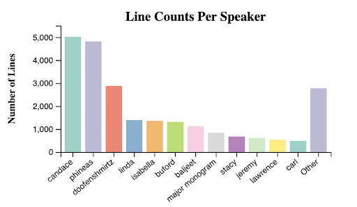

A bar chart is best used for counting the number of lines that are said by a character because it is the easiest and most clear way to show who has the most lines given a chosen filter.

### **Lines Per Episode _Timeline_**

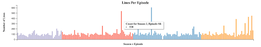

We used a bar chart because we felt it was the best way to show the count for lines in each episode. We considered using a line chart, but decided against it because those are typically used to show trends - however, this visualization emphasizes individual episode word count, which is better displayed by a bar. It also allowed us to pretty easily show season separations using color.

### **Word Occurrence _Wordcloud_**

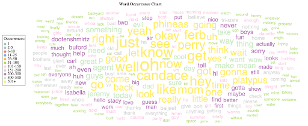

The word cloud was used to show which words were most commonly said instead of a bar chart because it is more visually interesting and it can display more words in a visually pleasing way than a bar chart. For example, the word cloud shows up to 250 words. Color was added with frequency thresholds to indicate differences in the frequency of occurrences of words (in addition to the font size) to match the color theme of the visualization. The addition of color allowed the word size to vary less which helped this visualization, because otherwise certain words that were a part of the chart but only said a relatively few number of times would not have been visible because other words were said much more often so the words with few occurrences would have been miniscule in comparison.

### **Interaction _Chord Diagram_**

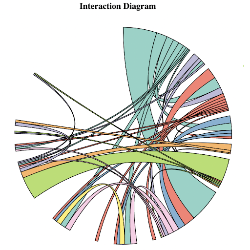

We used a chord diagram to show who shares scenes with each other because the chord diagram does a very good job of showing a part to whole relationship for each individual entry so we can get an idea of how many of the scenes Phineas is in Isabella or Candace is in. We felt that the chord diagram best shows this part to whole relationship.

### **When Main Characters Speak in Episodes _Line Chart_**

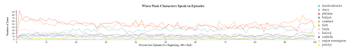

A line chart with multiple lines was selected because we could easily filter the visualization to display different combinations of main characters. We chose to map the episode line number into a percentage as a way to normalize the length of episodes. Additionally, we chose to show the raw number of lines spoken by a character at a percentage into the average episode instead of showing a percent of the character’s total lines to show who is speaking the most and prevent too much overlap of the lines. We were aware of the A/B plot structure of the show, where the kids build something spectacular and Perry stops Doofenshmirtz. This is why we wanted to capture characters’ line distributions as granularly as possible.  

## **Findings**

Phineas, one of the titular characters does not have the most lines in the show, instead Candace does.

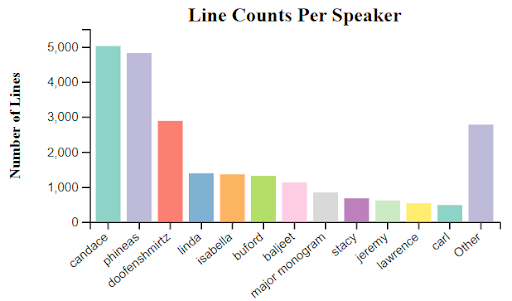

We also have found that Ferb, who is a largely non-speaking character, said the word well a lot and spoke most at the very end of the series.

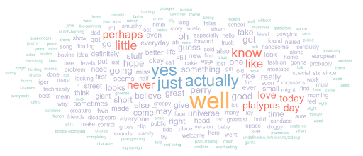

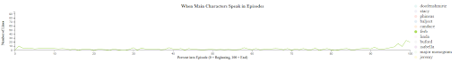

There’s one episode in Season 3 where only 2 lines are spoken by characters that weren’t filtered out by our pre-processing. That episode was one in which all the typical characters were replaced with cave people, who only spoke gibberish, and were given different names in the transcript. The 2 lines in that episode were spoken by a character “Bobbi”, who appeared in exactly 4 other episodes throughout the series.

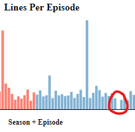

Lastly, we know Doofenshmirtz always says some form of “Curse you, Perry the Playtpus” near the end of the episode when he is inevitably defeated by the non-speaking animal. This can be seen by filtering the dataset to lines spoken by Doof, and then clicking on “perry” or “platypus” in the word cloud.

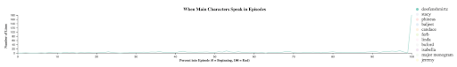

## **Process**

For this we used the d3 library for the majority of our charts, as well as the d3.cloud library which was used for the word cloud.

For our code structure we had main.js which handled creating the visualization objects, filtering data, and updating the charts. Then we had a file for each type of visualization which handled the work done in the visualization itself.

The code base can be found at [https://github.com/swiimii/vis_project3](https://github.com/swiimii/vis_project3). It can be downloaded from there and then run on a python http server. Or it is hosted by GitHub pages which can be found at [http://www.sam-scherer.com/vis_project3/](http://www.sam-scherer.com/vis_project3/). 

## **Demo Video**

<iframe width="560" height="315" src="https://www.youtube.com/embed/PBslZPFp4LQ" title="YouTube video player" frameborder="0" allow="accelerometer; autoplay; clipboard-write; encrypted-media; gyroscope; picture-in-picture" allowfullscreen></iframe>

## **Division of Work**

Sam Scherer

* Data preprocessing
* Character line count bar graph
* Episode line count bar graph
* Most of the layout work

Joseph Russell

* Character scene interaction chord diagram
* A little of the layout work

Jennifer Gutman

* Word cloud
* When characters speak line chart
* Reset button